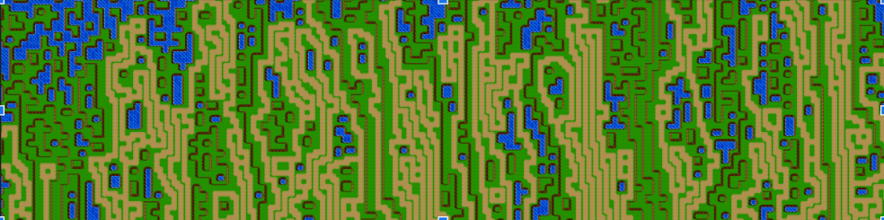

# Wave Function Collapse
## Branch
- `Cuda`: Implement cuda version. (slower)
- `openMP_bit_outside_in`: Implement bit openMP version. (slower)
- `set_4_dir`: Implement naive(set) openMP version. (faster in some cases)

## Run
```
> make
> ./a.out [-argument...]
```
One of the commands in the slide: `./a.out -h 64 -w 256 -r 2 -s 999 -b [type]`



Reference Time
- `Naive(std::set)`: 1160ms
- `Bit`: 41ms
- `openMP_bit_outside_in`: 152ms
- `set_4_dir`: 536ms
- `cuda`: -ms

## Input
### With argument
- `-w`, `--width` : `-w 10` set grid width to 10
- `-h`, `--height` : `-h 10` set grid height to 10
- `-r`, `--rule` : `-r 1` set pattern rule to 1 which is `Example` rule.
```c++
switch (ruleType)
{
case 0:
    rule = std::make_shared<Rules::Road>();
    break;
case 1:
    rule = std::make_shared<Rules::Example>();
    break;
case 2:
    rule = std::make_shared<Rules::Summer>();
    break;
case 3:
    rule = std::make_shared<Rules::RPGMap>();
    break;
default:
    rule = std::make_shared<Rules::Example>();
    break;
} 
```
- `-s`, `--seed` : `-s 999` set seed to 999
- `-b`, `--solverType` : `-b 1` enable bit version
    - `0`: naive version. Disable bit operator.
    - `1`: Bit version. enable by default that is faster than original one
    - `2`: Enable openMP/cuda implement at each branch.
- `-c`, `--selection` : `-c 1`. selection mode
    - `0` : order selection (top -> bottom, left -> right)


    - `1` : unorder selection (first element in hash table)


    - `2` : random selection

   - `3` : enable entropy

### No argument
- `--print-time` : print profiling time.
```
Profiling:
Propogate():
        Total: 0.053146 Average: 0.000932386 (ms)
        Count: 57       Min: 0.000136   Max: 0.00328
Collapse():
        Total: 0.004351 Average: 7.63333e-05 (ms)
        Count: 57       Min: 4.5e-05    Max: 0.000379
SelectOneCell():
        Total: 0.011284 Average: 0.000197965 (ms)
        Count: 57       Min: 4.8e-05    Max: 0.004931
```

- `--print-rules` : print pattern rules
```
->0
top:    3 
bottom: 4 8 
right:  1 2 8 12 15 
left:   2 3 6 7 9 11 

->1
top:    3 
bottom: 5 
right:  1 2 8 12 15 
left:   0 1 10 14 15 

...
```

- `--print-process` : print process at each iteration.
```
Iter: 1
unobserved: 63
BF search: 5    Distance: 1 (1,0)

Iter: 2
unobserved: 62
BF search: 4    Distance: 1 (-1,0)

...
```

- `--print-step` : print each collapse step
```
4 1 collapse to 7
-16--16--16--16--16--16--16--16-
-16--16--16--16--16--16--16--16-
-16--16--16--16--16--16--16--16-
-16--16--16--16--16--16--16--16-
-16- 7 -16--16--16--16--16--16-
-16--16--16--16--16--16--16--16-
-16--16--16--16--16--16--16--16-
-16--16--16--16--16--16--16--16-

...
```

- `--print-result` : print final result
```
 11  0  4  13  6  3  8  5 
 11  7  13  6  12  7  5  3 
 10  14  13  10  5  12  2  3 
 1  12  2  7  1  12  12  15 
 3  10  5  12  2  9  10  8 
 8  1  15  4  14  5  2  9 
 10  1  7  6  4  13  11  9 
 7  13  10  11  3  8  11  12
```

- `--save-result` : save reuslt to output_image.png


```
 15  2  3  3  3  3  3  4 
 5  6  3  3  3  3  3  4 
 5  6  3  3  3  0  2  4 
 5  6  7  7  3  4  6  4 
 5  6  11  11  0  8  6  4 
 5  10  12  14  8  5  6  4 
 5  5  5  5  5  5  10  8 
 5  5  5  5  5  5  5  5
```
